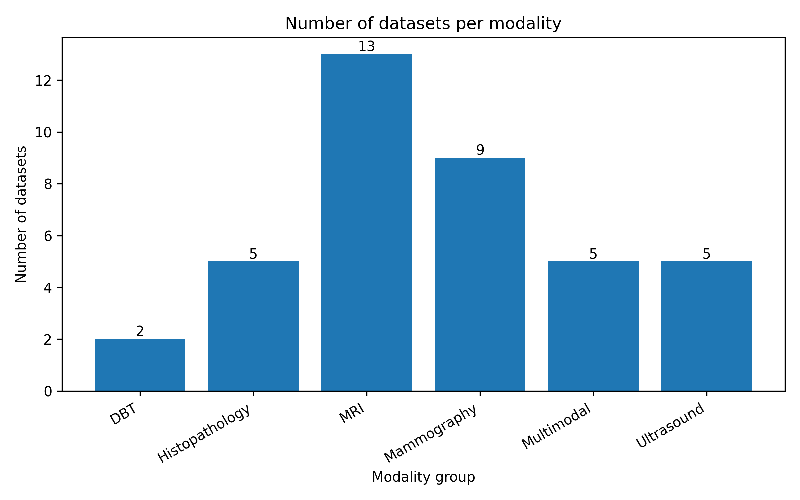
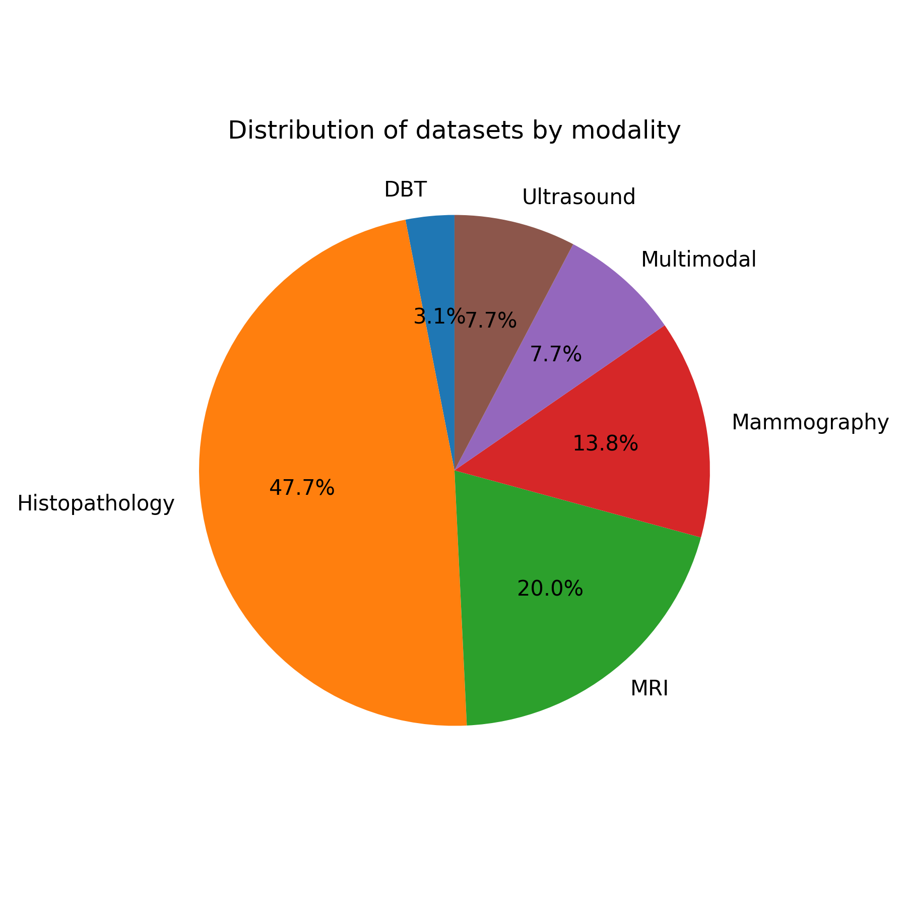
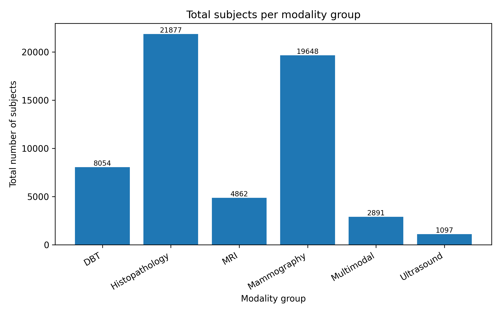
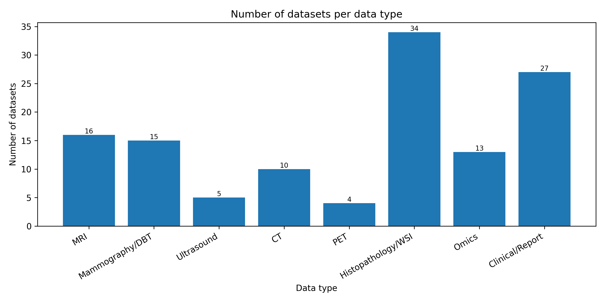
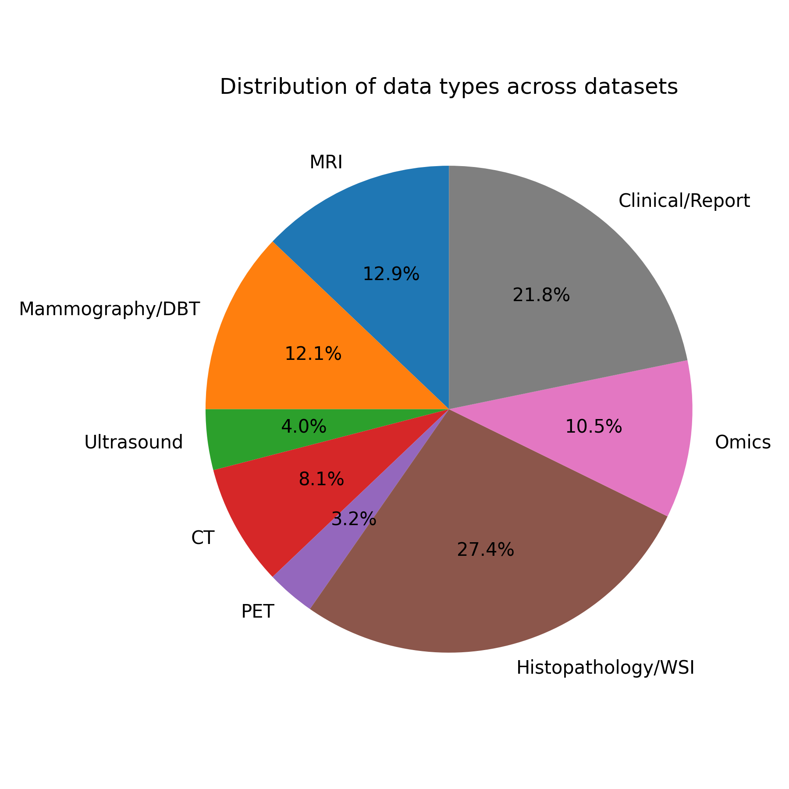

# Breast-Cancer-Multimodal-Imaging-Datasets

Credit: This repo inherits and extends some of the summaries from  
https://github.com/hugofigueiras/Breast-Cancer-Imaging-Datasets

This repository serves as a centralized resource listing **breast imaging and pathology datasets** commonly used in academic research, clinical training, and machine-learning applications. The goal is to provide in one place:

- A curated list of datasets across radiology (**MRI, MG/DBT, US, CT, PET**), histopathology / whole-slide images, and multimodal resources.
- High-level metadata (number of subjects, data types, supporting clinical / omics data).
- Pointers on *how to obtain* each dataset.

If you know more datasets and want to contribute, please submit a pull request – contributions are very welcome 😊  

All datasets are catalogued in: `data/datasets_master.csv`

Currently the CSV contains **60+ datasets** spanning radiology, histopathology and multimodal (imaging + clinical / omics) resources.

---

## Overview

The figures below summarize the contents of `datasets_master.csv`.

### Number of datasets per modality group

### Pie chart – distribution of datasets by modality group

Here, `ModalityGroup` is a coarse grouping:

- **MRI, Mammography, Ultrasound, DBT** – radiology modalities  
- **Histopathology** – histology / WSI / patch-level pathology datasets  
- **Multimodal** – datasets that combine ≥ 2 imaging modalities and/or imaging with omics / clinical data

### Total number of subjects per modality group

For histopathology datasets where only the number of slides is reported, slides are treated as a proxy for subjects.

### Datasets by data type

This bar plot counts, for each dataset, whether it contains:

- MRI  
- Mammography / DBT  
- Ultrasound  
- CT  
- PET  
- Histopathology / WSI  
- Omics (genomics, proteomics, molecular tests)  
- Clinical / Report (demographics, diagnosis, follow-up, treatment, pathology report, etc.)

If you also generated a pie chart for data types:

---

## Table of Contents

- [Datasets](#datasets)
  - [Ultrasound](#ultrasound)
  - [Digital Breast Tomosynthesis (DBT)](#digital-breast-tomosynthesis-dbt)
  - [Mammography](#mammography)
  - [MRI](#mri)
  - [Histopathology](#histopathology)
- [Repository structure](#repository-structure)
- [Contributing & Contact](#contributing--contact)

---

## Datasets

> 🔎 **Full list:** for the most up-to-date and complete metadata (including multimodal and histopathology / WSI datasets), please refer to `data/datasets_master.csv`.  
> The tables below highlight the main public radiology datasets.

### Ultrasound

| Dataset                           | Subjects | Nº Samples | Format | Size    | Year | Cite | Access data | Paired | Note |
|-----------------------------------|----------|-----------|--------|---------|------|------|-------------|--------|------|
| Breast Ultrasound Images (BUSI)   | 600      | 780       | PNG    | 204MB   | 2020 | [Dataset of breast ultrasound images](https://www.sciencedirect.com/science/article/pii/S2352340919312181 "Link to paper") | [Download here](https://www.kaggle.com/datasets/aryashah2k/breast-ultrasound-images-dataset_ "Download_link") | No | Ground-truth masks; labels: benign, malignant, normal |
| Breast Lesions USG               | 256      | 522       | PNG    | 66.67MB | 2024 | [Curated benchmark dataset for ultrasound based breast lesion analysis](https://www.nature.com/articles/s41597-024-02984-z "Link_to_paper") | [Download here](https://www.cancerimagingarchive.net/collection/breast-lesions-usg/#citations "Download_link") | Clinical | Patient-level labels, image-level annotations, tumour-level labels with all cases confirmed by follow-up or core-needle biopsy |
| UDIAT Breast Ultrasound Dataset B | 163      | 163       | N/A    | N/A     | 2017 | [Automated Breast Ultrasound Lesions Detection Using Convolutional Neural Networks](https://ieeexplore.ieee.org/document/8003418 "Link_to_paper") | [Request permission](https://helward.mmu.ac.uk/STAFF/m.yap/dataset.php) | No | – |
| OASBUD                            | 78       | 200       | Matlab | 296.8MB | 2017 | [Open access database of raw ultrasonic signals acquired from malignant and benign breast lesions](https://doi.org/10.1002/mp.12538 "Link_to_paper") | [Download here](https://zenodo.org/records/545928 "Download_link") | No | Raw RF signals for advanced ultrasound processing |
| BUS Synthetic Dataset             | 0        | 500       | PNG    | 9.7MB   | 2023 | [PDF-UNet: A semi-supervised method for segmentation of breast tumor images using a U-shaped pyramid-dilated network](https://doi.org/10.1016/j.eswa.2023.119718 "Link_to_paper") | [Download here](https://data.mendeley.com/datasets/r4phtn49r7/1 "Download_link") | No | Synthetic BUS images for segmentation / augmentation |

---

### Digital Breast Tomosynthesis (DBT)

| Dataset                     | Subjects | Nº Samples | Format | Size   | Year | Cite | Download |
|-----------------------------|----------|-----------|--------|--------|------|------|----------|
| Breast Cancer Screening DBT | 5,060    | 22,032    | DICOM  | 1.63TB | 2024 | [A Data Set and Deep Learning Algorithm for the Detection of Masses and Architectural Distortions in Digital Breast Tomosynthesis Images](https://doi.org/10.1001/jamanetworkopen.2021.19100 "Link_to_paper") | [Download here](https://doi.org/10.7937/e4wt-cd02 "Download_link") |
| EA1141                      | 1,444    | 500       | DICOM  | 2.82TB | 2023 | [Abbreviated Breast MRI and Digital Tomosynthesis Mammography in Screening Women With Dense Breasts (EA1141)](https://doi.org/10.7937/2BAS-HR33) | [Download here](https://doi.org/10.7937/2BAS-HR33 "Download_link") |
| VICTRE                      | 2,994    | 2,994     | DICOM  | 1.03TB | 2019 | [The VICTRE Trial: Open-Source, In-Silico Clinical Trial for Evaluating Digital Breast Tomosynthesis](http://doi.org/10.7937/TCIA.2019.ho23nxaw) | [Download here](http://doi.org/10.7937/TCIA.2019.ho23nxaw "Download_link") |

---

### Mammography

| Dataset                                  | Subjects | Nº Samples | Format | Size     | Year | Cite | Download |
|------------------------------------------|----------|-----------|--------|----------|------|------|----------|
| CBIS-DDSM                                | 1,566    | 6,671     | DICOM  | 161.51GB | 2017 | [Curated mammography data set for CAD research](https://www.nature.com/articles/sdata2017177) | [Download here](https://www.cancerimagingarchive.net/collection/cbis-ddsm/) |
| CMMD                                     | 1,775    | 3,728     | DICOM  | 22.86GB  | 2021 | [Chinese Mammography Database (CMMD)](https://doi.org/10.7937/tcia.eqde-4b16) | [Download here](https://doi.org/10.7937/tcia.eqde-4b16) |
| CDD-CESM                                 | 326      | 2,006     | JPEG   | 1.5GB    | 2021 | [Categorized CESM dataset](https://doi.org/10.7937/29kw-ae92) and related papers | [Download here](https://wiki.cancerimagingarchive.net/pages/viewpage.action?pageId=109379611#109379611bcab02c187174a288dbcbf95d26179e8) |
| VinDr-Mammo                              | 5,000    | 20,000    | DICOM  | N/A      | 2022 | [Large-scale benchmark dataset for CAD in FFDM](https://www.medrxiv.org/content/10.1101/2022.03.07.22272009v1) | [Download here](https://www.physionet.org/content/vindr-mammo/1.0.0/) |
| INBreast                                 | 115      | 410       | N/A    | N/A      | 2012 | [INbreast: full-field digital mammographic database](https://pubmed.ncbi.nlm.nih.gov/22078258/) | [Contact the authors](https://pubmed.ncbi.nlm.nih.gov/22078258/) |
| MIAS                                     | N/A      | 322       | PGM    | 1.5GB    | 2015 | [MIAS database v1.21](https://www.repository.cam.ac.uk/items/b6a97f0c-3b9b-40ad-8f18-3d121eef1459) | [Download here](https://www.repository.cam.ac.uk/items/b6a97f0c-3b9b-40ad-8f18-3d121eef1459) |
| Breast Tumor Mammography Dataset for CV  | N/A      | 3,383     | JPG    | 103.49MB | 2024 | N/A | [Download here](https://www.kaggle.com/datasets/hayder17/breast-cancer-detection) |

---

### MRI

| Dataset                      | Subjects | Nº Samples | Format | Size     | Year | Cite | Download |
|------------------------------|----------|-----------|--------|----------|------|------|----------|
| ACRIN-6667                   | 984      | 984       | DICOM  | 199.59GB | 2021 | [ACRIN-Contralateral-Breast-MR (ACRIN 6667)](https://doi.org/10.7937/Q1EE-J082) | [Download here](https://doi.org/10.7937/Q1EE-J082) |
| ACRIN-6698                   | 385      | 385       | DICOM  | 1.94TB   | 2021 | [ACRIN 6698/I-SPY2 Breast DWI](https://doi.org/10.7937/tcia.kk02-6d95) | [Download here](https://doi.org/10.7937/tcia.kk02-6d95) |
| ISPY1                        | 222      | 222       | DICOM  | 78.36GB  | 2016 | [I-SPY1 / ACRIN 6657 DCE-MRI](http://doi.org/10.7937/K9/TCIA.2016.HdHpgJLK) | [Download here](http://doi.org/10.7937/K9/TCIA.2016.HdHpgJLK) |
| ISPY2                        | 719      | 719       | DICOM  | 4.16TB   | 2022 | [I-SPY2 Breast DCE-MRI trial](https://doi.org/10.7937/TCIA.D8Z0-9T85) | [Download here](https://www.cancerimagingarchive.net/collection/ispy2/) |
| Duke Breast Cancer MRI       | 922      | 922       | DICOM  | 368.89GB | 2022 | [Radiogenomics of breast cancer with 922 subjects](https://www.ncbi.nlm.nih.gov/pmc/articles/PMC6134102/) | [Download here](https://www.cancerimagingarchive.net/collection/duke-breast-cancer-mri/) |
| Breast Cancer Patients MRI's | 700      | 700       | JPG    | 201.4MB  | 2021 | N/A | [Download here](https://www.kaggle.com/datasets/uzairkhan45/breast-cancer-patients-mris) |
| Breast MRI NACT Pilot        | 64       | 64        | DICOM  | 19.51GB  | 2023 | [Single site breast DCE-MRI NACT data](https://doi.org/10.7937/K9/TCIA.2016.QHSYHJKY) | [Download here](https://doi.org/10.7937/K9/TCIA.2016.QHSYHJKY) |
| QIN Breast DCE-MRI           | 10       | 10        | DICOM  | 15.9GB   | 2019 | [QIN Breast DCE-MRI challenge](https://doi.org/10.7937/k9/tcia.2014.a2n1ixox) | [Download here](https://doi.org/10.7937/k9/tcia.2014.a2n1ixox) |
| QIN-BREAST                   | 67       | 67        | DICOM  | 11.41GB  | 2020 | [Data From QIN-BREAST (Version 2)](https://doi.org/10.7937/K9/TCIA.2016.21JUEBH0) | [Download here](https://www.cancerimagingarchive.net/collection/qin-breast/) |
| QIN-BREAST-02                | 13       | 13        | DICOM  | 4.19GB   | 2019 | [Data from QIN-BREAST-02](https://doi.org/10.7937/TCIA.2019.4cfm06rr) | [Download here](https://www.cancerimagingarchive.net/collection/qin-breast-02/) |
| Advanced MRI Breast Lesions  | 632      | 632       | DICOM  | 646GB    | 2024 | [Advanced-MRI-Breast-Lesions](https://doi.org/10.7937/C7X1-YN57) | [Download here](https://www.cancerimagingarchive.net/collection/advanced-mri-breast-lesions/) |
| BREAST DIAGNOSIS             | 88       | 88        | DICOM  | 60.87GB  | 2011 | [BREAST-DIAGNOSIS dataset](http://doi.org/10.7937/K9/TCIA.2015.SDNRQXXR) | [Download here](https://www.cancerimagingarchive.net/collection/breast-diagnosis/) |

---

### Histopathology

Histopathology / WSI datasets (e.g. **TCGA-BRCA, CPTAC-BRCA, CAMELYON, BRACS, TUPAC16, NuCLS, BCSS, DROID-Breast, ACROBAT, GTEx, Prov-Path**, etc.) are all integrated into `data/datasets_master.csv`.

For more detailed notes, including pretraining / benchmarking usage within my projects, see also:  
https://github.com/haonguyenthai/Breast-Cancer-Pathology-Dataset

---

## Repository structure

- `data/datasets_master.csv` – master table with all datasets and metadata.  
- `scripts/generate_figures.py` – generate summary figures (modality histogram, pie charts, subject distribution, data-type bar/pie).  
- `images/` – rendered figures used in this README.  
- Extra scripts (e.g. multimodal intersection plots) – visualize overlaps between imaging, histopathology, omics and clinical data across cohorts.

---

## Contributing & Contact

- **Contributions** – suggestions for new datasets, corrections, or improvements to the metadata / scripts are welcome. Please open an issue or submit a pull request.  
- **Contact** – for dataset access, follow the official links provided in the tables and CSV, or contact dataset maintainers directly.  

For questions about this repository, feel free to email me at **hao.nguyen@uq.edu.au**.
